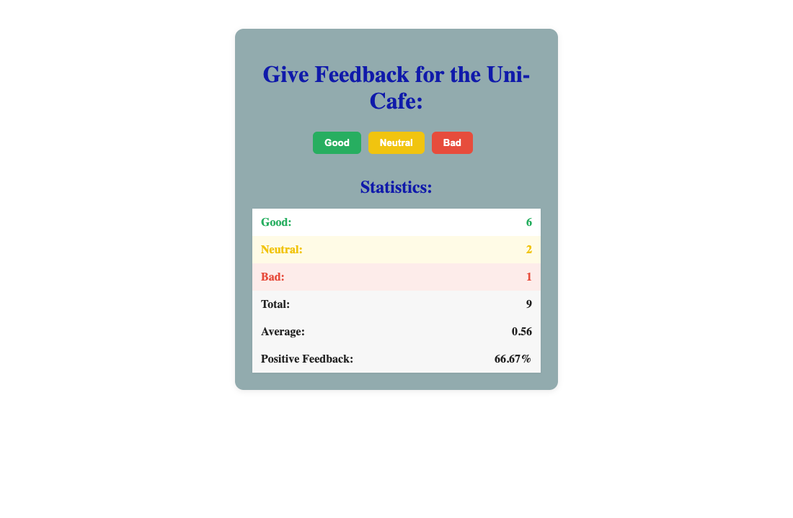

# Unicafe Feedback

A small React app that collects customer feedback (good, neutral, bad) and shows live statistics: total, average score and the share of positive feedback. Statistics appear only after the first click.

Built as an exercise from the [Full Stack Open](https://fullstackopen.com/) course (part 1).



## Built with

- React (`useState`)
- Vite
- Small reusable components: `Button` and `StatisticLine` in [`src/components/`](src/components)

## Run locally

```bash
npm install
npm run dev
```
